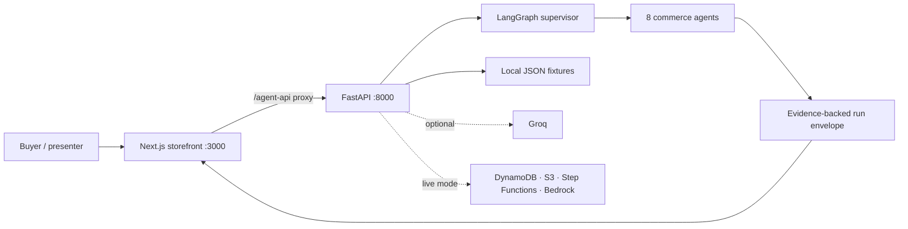

# Kavach Saathi

Kavach Saathi is an agent-protected commerce prototype built around a Meesho-style
shopping journey. A Next.js storefront is connected to a FastAPI and LangGraph
backend where eight evidence-driven agents inspect catalogue media, specifications,
sizes, reviews, voice questions, addresses, delivery confirmation, and returns.

The repository is designed to be presentation-ready and reproducible without real
customer data. Demo mode runs locally with deterministic fixtures; Groq can be enabled
for grounded product Q&A while the safety decisions remain evidence-backed.


## What is included

- A responsive Next.js storefront with search, ten category filters, product drawers,
  cart, checkout, agent activity, delivery confirmation, and return simulation.
- Exactly 500 detailed products: 50 in each of ten marketplace categories.
- A typed FastAPI contract and interactive OpenAPI documentation.
- Eight LangGraph-orchestrated commerce safety agents.
- Deterministic demo mode plus Groq-backed grounded Q&A.
- Local JSON persistence for the demo and DynamoDB/S3/Step Functions adapters for AWS.
- Synthetic buyers, sellers, orders, reviews, returns, addresses, labels, audio, video,
  and product-card fixtures.
- Automated API, workflow, data-integrity, DIGIPIN, and OpenAPI tests.
- AWS SAM infrastructure for the API, worker, workflow state machine, tables, and media
  bucket.

## System architecture



The browser never receives provider credentials. The Next.js server proxies API and
mock-media requests to FastAPI, and credentials stay in the root `.env` file or AWS
Secrets Manager.

## The eight agents

| # | Agent | Trigger | Responsibility |
|---|---|---|---|
| 1 | Catalogue Truth Builder | Listing/product inspection | Checks image evidence, reuse signals, and catalogue completeness. |
| 2 | Honest Spec Enforcer | Listing/product inspection | Compares seller claims with label-backed fabric, GSM, color, and care evidence. |
| 3 | Cross-Seller Size Translator | Size request or size-related voice query | Recommends a size from measurements and successful purchase history across sellers. |
| 4 | Image-Truth Review Filter | Review inspection | Keeps review text while hiding irrelevant or misleading review media. |
| 5 | Trusted Voice Q&A | Hindi or English product question | Returns a grounded answer from product, size, delivery, and policy evidence; Groq is optional. |
| 6 | Address Guardian | Checkout/address verification | Validates coordinates, postal PIN, locality evidence, and DIGIPIN consistency. |
| 7 | Delivery Confirmation | Pre-dispatch confirmation | Records buyer confirmation or routes an address update back through Agent 6. |
| 8 | Return Authenticity Verifier | Return evidence review | Compares return media with order evidence and routes uncertain cases to manual inspection. |

Key safeguards:

- Agent confidence represents evidence strength, not the probability that a buyer is
  dishonest.
- Irrelevant review media can be hidden without deleting the written review.
- Low-confidence returns are never automatically denied.
- The delivery-confirmation channel is simulated in demo mode.
- Raw provider errors are not presented to buyers.

## Dataset

All business records are generated deterministically with seed `20260713` and live in
`data/seed/`.

| Collection | Count | File |
|---|---:|---|
| Products | 500 | `data/seed/products.json` |
| Reviews | 1,000 | `data/seed/reviews.json` |
| Orders | 200 | `data/seed/orders.json` |
| Return cases | 60 | `data/seed/returns.json` |
| DIGIPIN-aware addresses | 40 | `data/seed/addresses.json` |
| Buyers | 10 | `data/seed/buyers.json` |
| Sellers | 12 | `data/seed/sellers.json` |

Every category contains exactly 50 products:

1. Popular
2. Kurti, Saree & Lehenga
3. Women Western
4. Lingerie
5. Men
6. Kids & Toys
7. Home & Kitchen
8. Beauty & Health
9. Jewellery & Accessories
10. Bags & Footwear

Product records include pricing, inventory, delivery promise, seller evidence,
materials, occasions, size charts where appropriate, highlights, badges, and a
presentation hook. No real customer records or copied review text are included.

The stable golden-demo IDs are:

- Buyer: `B-001` — Sunita, Hindi preference
- Seller: `S-001`
- Product: `P-001` — Maroon Floral Cotton Kurta
- Order: `O-GOLDEN`
- Matching review: `RV-GOOD`
- Irrelevant-media review: `RV-BAD`

## Prerequisites

- Python 3.11 or newer
- [uv](https://docs.astral.sh/uv/)
- Node.js 20 or newer and npm
- `ffmpeg` only if regenerating audio/video/media fixtures
- AWS SAM CLI only for AWS deployment

## Quick start

Clone the repository and install both application stacks:

```bash
git clone https://github.com/abhijaatx/kavach-saathi.git
cd kavach-saathi
cp .env.example .env
uv sync --extra dev
npm --prefix web ci
```

Start FastAPI and Next.js together:

```bash
./scripts/start_storefront.sh
```

Open:

- Storefront: <http://127.0.0.1:3000>
- Backend landing demo: <http://127.0.0.1:8000>
- API documentation: <http://127.0.0.1:8000/docs>
- Health and dataset counts: <http://127.0.0.1:8000/health>

`Ctrl+C` stops both services.

### Run services separately

Terminal 1:

```bash
PYTHONPATH=src uv run uvicorn kavach_saathi.app:app --reload --host 127.0.0.1 --port 8000
```

Terminal 2:

```bash
npm --prefix web run dev -- --hostname 127.0.0.1 --port 3000
```

The frontend proxy target defaults to `http://127.0.0.1:8000`. Override it with
`AGENT_API_ORIGIN` when the API runs somewhere else.

## Groq configuration

Demo mode requires no provider key. To use Groq for grounded product Q&A, edit the
Git-ignored root `.env`:

```dotenv
APP_MODE=demo
REASONING_MODE=groq
GROQ_API_KEY=your_key_here
GROQ_MODEL=openai/gpt-oss-120b
GROQ_REASONING_EFFORT=medium
```

Restart the backend after changing `.env`. The health endpoint reports whether the
active reasoning provider is `fixture-rules` or `groq`.

Never put a real key in `.env.example`, frontend code, screenshots, issues, or Git
history. If a key has been shared outside a secret manager, rotate it before using the
repository in a public environment.

## API overview

All workflow routes use the `/v1` prefix.

| Method | Endpoint | Purpose |
|---|---|---|
| `GET` | `/health` | Mode, provider, and fixture counts |
| `GET` | `/v1/storefront/products` | Search/filter the 500-product catalogue |
| `GET` | `/v1/storefront/products/{product_id}` | Product, seller, media, and review detail |
| `GET` | `/v1/storefront/demo-context` | Golden buyer/order/address context |
| `POST` | `/v1/listings/analyze` | Agents 1 and 2 |
| `POST` | `/v1/size/recommend` | Agent 3 |
| `POST` | `/v1/reviews/analyze` | Agent 4 |
| `POST` | `/v1/voice/query` | Agent 5, optionally preceded by Agent 3 |
| `POST` | `/v1/address/verify` | Agent 6 |
| `POST` | `/v1/orders/{order_id}/confirm-simulated` | Agent 7 |
| `POST` | `/v1/returns/analyze` | Agent 8 |
| `GET` | `/v1/runs/{run_id}` | Retrieve workflow state |
| `GET` | `/v1/runs/{run_id}/events` | Server-sent evidence events |
| `POST` | `/v1/uploads/presign` | Create a demo or S3 upload target |
| `PUT` | `/v1/mock-uploads/{object_key}` | Local demo upload target |

Example size recommendation:

```bash
curl -sS http://127.0.0.1:8000/v1/size/recommend \
  -H 'content-type: application/json' \
  -d '{"buyer_id":"B-001","product_id":"P-001"}' | jq
```

Example grounded Hindi question:

```bash
curl -sS http://127.0.0.1:8000/v1/voice/query \
  -H 'content-type: application/json' \
  -d '{"buyer_id":"B-001","product_id":"P-001","text":"Mujhe kaunsa size lena chahiye?","language":"hi"}' | jq
```

Every workflow returns a typed run envelope containing `run_id`, `trace_id`, status,
agent results, evidence, actions, confidence, and bilingual user-facing messages. 
## Configuration reference

Start from `.env.example`. The most important variables are:

| Variable | Default | Meaning |
|---|---|---|
| `APP_MODE` | `demo` | `demo` uses local fixtures; `live` enables cloud adapters. |
| `REASONING_MODE` | `demo` | Set to `groq` to use Groq while retaining local fixture data. |
| `GROQ_API_KEY` | empty | Server-side Groq credential. |
| `GROQ_MODEL` | `openai/gpt-oss-120b` | Groq model used for structured reasoning. |
| `DATA_DIR` | `data/seed` | Local JSON database directory. |
| `ASSET_DIR` | `assets/mock` | Local media fixture directory. |
| `FRONTEND_ORIGIN` | `http://localhost:3000` | FastAPI CORS origin. |
| `AWS_REGION` | `ap-south-1` | AWS provider region. |
| `WORKFLOW_TABLE` | `kavach-saathi-workflows` | Run/checkpoint DynamoDB table. |
| `DOMAIN_TABLE` | `kavach-saathi-domain` | Live domain-record DynamoDB table. |
| `MEDIA_BUCKET` | `kavach-saathi-media` | S3 upload and generated-media bucket. |
| `STATE_MACHINE_ARN` | empty | Step Functions supervisor ARN. |
| `EXTERNAL_SECRET_ARN` | empty | Secrets Manager JSON for live credentials. |

The full provider list includes AWS Bedrock/Nova, Bhashini, Google Vision, Amazon
Location, and optional Twilio settings. All names and safe defaults are documented in
`.env.example`.

## Data and media regeneration

Rebuild the deterministic JSON database:

```bash
PYTHONPATH=src uv run python scripts/generate_seed_data.py
```

Regenerate media fixtures after installing `ffmpeg`:

```bash
PYTHONPATH=src uv run python scripts/generate_fixture_media.py
```

The media generator recreates `assets/mock/products`, `catalog`, `labels`, `reviews`,
`returns`, and `audio`, then writes `assets/mock/provenance.json`. If the untracked
`assets/scraped_products` cache is absent, it creates deterministic illustrated
product cards instead of embedding externally sourced product photography.

`scripts/scrape_product_images.py` is an optional research helper. Its raw downloads
are intentionally excluded from Git because image-search results do not establish
redistribution rights. Review the source terms and obtain permission before using any
downloaded image outside a private demo.

Other data utilities:

```bash
PYTHONPATH=src uv run python scripts/evaluate_demo.py
PYTHONPATH=src uv run python scripts/preflight.py
PYTHONPATH=src uv run python scripts/load_aws_seed.py
```

## Testing and quality checks

Run the complete local verification suite:

```bash
uv run pytest
uv run ruff check .
npm --prefix web run lint
npm --prefix web run build
```

The test suite verifies:

- agent workflow outputs and idempotent run behavior;
- all 500 products and the exact 50-per-category invariant;
- review, order, return, address, and media-fixture integrity;
- DIGIPIN encode/decode behavior;
- health, storefront, upload, event-stream, and agent endpoints;
- committed OpenAPI contract parity.

UI evidence and the product-drawer comparison are stored in `reports/`; the final QA
record is [design-qa.md](design-qa.md).

## AWS deployment

`template.yaml` defines:

- a containerized FastAPI Lambda;
- a containerized agent worker Lambda;
- API Gateway HTTP API;
- a Standard Step Functions state machine;
- workflow and domain DynamoDB tables;
- a private S3 media bucket with seven-day demo-upload expiry;
- IAM access for Bedrock, Amazon Location, S3, DynamoDB, and Secrets Manager.

Deploy with AWS SAM:

```bash
sam build
sam deploy --guided
PYTHONPATH=src uv run python scripts/load_aws_seed.py
APP_MODE=live uv run python scripts/preflight.py
```

Use the stack outputs to populate `WORKFLOW_TABLE`, `DOMAIN_TABLE`, `MEDIA_BUCKET`,
and `STATE_MACHINE_ARN`. Put provider credentials in the Secrets Manager JSON named by
`EXTERNAL_SECRET_ARN`; do not package credentials into the Lambda image.

## Repository layout

```text
.
├── assets/mock/              # Demo product, label, review, return, and audio media
├── data/seed/                # Local JSON database and dataset provenance
├── docs/                     # Architecture, integration contract, and OpenAPI JSON
├── reports/                  # Demo evaluation and UI QA evidence
├── scripts/                  # Start, generation, evaluation, scraping, and AWS utilities
├── src/kavach_saathi/
│   ├── agents/               # Eight agent implementations
│   ├── orchestration/        # LangGraph graphs and workflow service
│   ├── providers/            # Demo and live provider adapters
│   ├── app.py                # FastAPI routes and Lambda handler
│   ├── repository.py         # JSON and DynamoDB domain repositories
│   └── store.py              # In-memory and DynamoDB workflow stores
├── tests/                    # API, workflow, data, DIGIPIN, and contract tests
├── web/                      # Next.js storefront
├── Dockerfile                # Lambda container image
├── template.yaml             # AWS SAM infrastructure
└── pyproject.toml            # Python package and tooling configuration
```

## Security, privacy, and limitations

- `.env`, dependency folders, build output, caches, and raw scraped images are ignored
  by Git.
- The repository contains synthetic business records and no real customer data.
- Demo confirmation is simulated; no phone call or message is sent.
- There is no production authentication, authorization, payment processing, rate
  limiting, or seller onboarding.
- Live mode requires a full security review, provider-specific data handling rules,
  observability, abuse prevention, and human escalation procedures.
- A confidence score must never be presented as proof of fraud or dishonesty.

## Attribution and legal notes

The commerce flow was inspired by the public screen journey in
[AshokPrjapati/Meesho-clone](https://github.com/AshokPrjapati/Meesho-clone) at commit
`4057ed337d0d7999d07f7e261b12887c9d904ddb`. The Kavach Saathi storefront code and
local fixtures were written for this project; the reference repository's retired
backend credentials and source assets are not included.

The Python DIGIPIN implementation is based on the Department of Posts reference and
is covered by the Apache 2.0 notice in [NOTICE](NOTICE). See [web/ATTRIBUTION.md](web/ATTRIBUTION.md)
for the storefront reference record.

No project-wide open-source license is granted by this repository unless a separate
`LICENSE` file is added. Third-party components remain subject to their own licenses.
