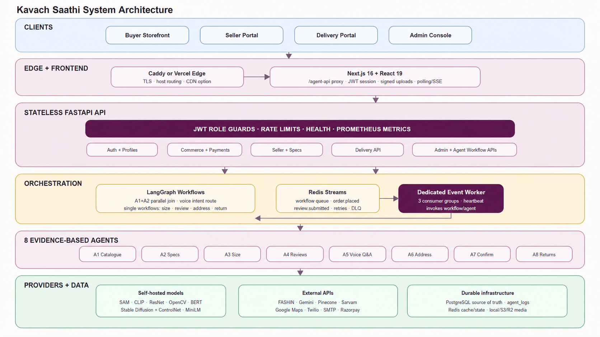
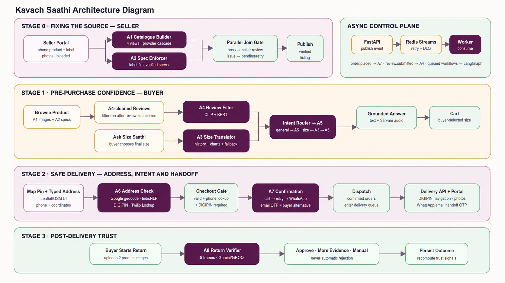

# Kavach Saathi

**Live deployment:** [https://shop.65-2-86-148.sslip.io](https://shop.65-2-86-148.sslip.io)

Kavach Saathi is an evidence-first marketplace safety platform. A Next.js storefront
and FastAPI backend coordinate eight AI agents across the seller, buyer, delivery, and
return journeys. Every automated decision carries evidence and a confidence score;
uncertain outcomes are sent for human review instead of being presented as proof of
fraud.

> The records and media included with this repository are synthetic demonstration
> data. External providers run only when their credentials are configured and expose
> an honest degraded state when they are unavailable.

## What the platform does

- Provides role-scoped experiences for buyers, sellers, delivery personnel, and
  administrators.
- Supports catalogue discovery, wishlist, cart, address management, COD and sandbox
  prepaid checkout, orders, reviews, returns, and exchanges.
- Turns seller product and label photographs into consistent multi-view catalogues and
  verified structured specifications.
- Recommends sizes from seller charts, buyer measurements, and cross-seller fit history.
- Filters unrelated review media while preserving the buyer's written review.
- Validates map coordinates, postal information, locality, phone data, and DIGIPIN
  before dispatch.
- Confirms orders through voice calls with bounded retries and WhatsApp fallback.
- Compares return evidence with delivery evidence and escalates ambiguity to a manual
  inspection queue.
- Records provider, evidence, confidence, latency, and workflow state for every agent
  run.

## ⚠️ Known Limitations (Please Read Before Testing)

| Feature | Limitation | What to do instead |
|---|---|---|
| **WhatsApp Order Confirmation** | WhatsApp messaging uses a Twilio trial account. Only **one specific verified number** can receive WhatsApp messages (trial accounts are restricted to a single sandbox number). | Use the **email confirmation option** when confirming orders — it works without any restrictions. |
| **Seller Photo Upload / Catalogue Generation** | Catalogue view generation uses the [FASHN API](https://fashn.ai/), which is a paid service. We currently have **~40 credits remaining**, and each product listing consumes **4 credits** (one per catalogue view). | Please use this feature sparingly — list only a couple of test products to avoid exhausting the credits during judging. |

## Architecture

### System architecture



### Agent workflows



PostgreSQL is the source of truth. Redis provides cache, workflow state, and durable
Streams-based event delivery. FastAPI publishes queued work to a dedicated worker,
while LangGraph coordinates the relevant agents. The Next.js application exposes all
four portals and keeps API credentials server-side through the `/agent-api/*` proxy.

## The eight agents

| # | Agent | Responsibility |
|---:|---|---|
| 1 | Catalogue Truth Guardian | Segments seller product photos, checks image quality and possible reuse, and generates front, back, left, and right catalogue views through a provider cascade. |
| 2 | Honest Spec Enforcer | Extracts label-backed fabric, GSM, colour, and care details; computer vision fills only fields the label does not provide. |
| 3 | Cross-Seller Size Translator | Recommends a size using the seller chart, buyer measurements, purchase history, and fit feedback, with a deterministic fallback. |
| 4 | Image-Truth Review Filter | Uses image/text relevance scoring to hide review media that does not match the product while retaining the written review. |
| 5 | Trusted Voice Q&A | Answers questions from verified catalogue, order, review, address, and return evidence, with multilingual text and optional Sarvam speech. |
| 6 | Address Guardian | Cross-checks coordinates, locality, postal PIN, phone information, and the India Post DIGIPIN calculation. |
| 7 | Delivery Confirmation | Confirms buyer intent before dispatch through Twilio voice, Sarvam transcription, retries, and WhatsApp fallback. |
| 8 | Return Authenticity Verifier | Compares sampled return-video frames with delivery/catalogue evidence using CLIP, ResNet-50, and multimodal reasoning; uncertain cases go to manual inspection. |

See [the detailed agent guide](docs/AGENTS.md), [architecture notes](docs/architecture.md),
and [API reference](docs/API.md) for implementation-level behavior and fallback rules.

## Repository layout

```text
web/                    Next.js portals and Playwright journeys
src/kavach_saathi/      FastAPI APIs, agents, providers, orchestration, and persistence
migrations/             Alembic database migrations
tests/                  Backend integration, workflow, and feature tests
data/seed/              Synthetic demonstration records
assets/mock/            Synthetic product, catalogue, label, and upload media
docs/images/            README architecture images
scripts/                Seed, backup, restore, and local-development utilities
```

## Run locally

### Prerequisites

The recommended setup uses [Git](https://git-scm.com/) and
[Docker Desktop](https://www.docker.com/products/docker-desktop/) with Docker Compose.
Allow at least 20 GB of free disk space: the first backend build installs the CPU
PyTorch and Hugging Face model stack and can take several minutes.

External API keys are optional for local exploration. With the defaults from
`.env.example`, the application starts in deterministic demo mode and reports
unconfigured providers honestly.

### Recommended: complete Docker setup

1. Clone the repository and enter it:

   ```bash
   git clone https://github.com/Palak24Ol/Kavach-Saathi.git
   cd Kavach-Saathi
   ```

2. Create the local environment file.

   macOS/Linux:

   ```bash
   cp .env.example .env
   ```

   Windows PowerShell:

   ```powershell
   Copy-Item .env.example .env
   ```

   The checked-in defaults already point at local PostgreSQL and Redis. Add provider
   credentials to `.env` only for integrations you want to exercise, such as Gemini,
   Groq, Google Maps, Pinecone, Sarvam, Twilio, or Razorpay. Never commit `.env`.

3. Download the demo assets (product images, mock media) from Google Drive and place them in the project root:

   **[📁 Download assets folder from Google Drive](https://drive.google.com/drive/folders/1prI-CaVvp6UP4dNRZPuMsB7R87YS4npb?usp=sharing)**

   Download the folder and extract/place it so the directory structure is:
   ```
   Kavach-Saathi/
   └── assets/
       ├── mock/
       └── ...
   ```

   > These are synthetic demonstration images. Without them the app runs but product images will not load.

4. Build the application images and start the databases:

   ```bash
   docker compose build
   docker compose up -d postgres redis
   ```

5. Apply the schema and load the synthetic demonstration catalogue:

   ```bash
   docker compose run --rm backend alembic upgrade head
   docker compose run --rm backend python scripts/generate_seed_data.py
   ```

   The seed command resets the local application tables. Run it on first setup or when
   you intentionally want fresh demo data, not after creating local records you need to
   keep.

6. Start the API, event worker, and web application:

   ```bash
   docker compose up -d
   docker compose ps
   ```

7. Confirm that the backend is ready:

   ```bash
   curl http://localhost:8000/health
   ```

   PowerShell alternative:

   ```powershell
   Invoke-RestMethod http://localhost:8000/health
   ```

### Local URLs

- Buyer storefront: <http://localhost:3000>
- Seller portal: <http://localhost:3000/seller>
- Delivery portal: <http://localhost:3000/delivery>
- Admin console: <http://localhost:3000/admin>
- API documentation: <http://localhost:8000/docs>
- Health endpoint: <http://localhost:8000/health>

The seed script gives every seeded account the password `KavachDemo@2026`. Useful
accounts include:

| Role | Email |
|---|---|
| Buyer | `b-001@buyer.kavachsaathi.test` |
| Seller | `s-001@seller.kavachsaathi.test` |
| Admin | `admin@kavachsaathi.test` |

Create a delivery-person account from the storefront signup form; successful login or
signup redirects that role to `/delivery`.

### Common Docker commands

```bash
# Follow application logs
docker compose logs -f backend worker frontend

# Stop containers while keeping database/model-cache volumes
docker compose down

# Rebuild after dependency or Dockerfile changes
docker compose up -d --build

# Apply new migrations
docker compose run --rm backend alembic upgrade head
```

On Windows, `scripts/refresh_local.ps1` can copy source changes into existing
containers, apply migrations, restart the application services, and wait for health:

```powershell
.\scripts\refresh_local.ps1
```

### Alternative: run application processes on the host

This path requires Python 3.11+, [uv](https://docs.astral.sh/uv/), Node.js 20+,
PostgreSQL, and Redis. You can use the Compose databases while running FastAPI and
Next.js directly:

```bash
docker compose up -d postgres redis
uv sync --extra dev
npm --prefix web ci
uv run alembic upgrade head
uv run python scripts/generate_seed_data.py
```

Then run these in separate terminals:

```bash
# Terminal 1: FastAPI; demo-mode event consumers run in this process
uv run uvicorn kavach_saathi.app:app --reload --port 8000

# Terminal 2: Next.js
npm --prefix web run dev
```

### Run checks

```bash
uv run pytest
uv run ruff check .
npm --prefix web run lint
npm --prefix web run build
```

See [DEPLOYMENT.md](DEPLOYMENT.md) for production configuration and deployment details.

## Open Source Attributions

This inventory covers the direct dependencies declared by this repository and the
open-source runtimes explicitly used by its Docker deployment. Python dependencies
use the supported ranges in `pyproject.toml` because the project does not commit a
Python lockfile; exact JavaScript versions come from `web/package-lock.json`. Indirect
dependencies retain their own notices in the installed distributions and lockfile.
Commercial APIs and hosted services are intentionally excluded from this open-source
list.

### Platform and infrastructure

| Name & version | License | Role in the build | Source |
|---|---|---|---|
| Python 3.13 (`python:3.13-slim`) | PSF License | Backend and worker runtime | [python/cpython](https://github.com/python/cpython) |
| Node.js 22 (`node:22-alpine`) | MIT + bundled third-party notices | Next.js build and production runtime | [nodejs/node](https://github.com/nodejs/node) |
| PostgreSQL 16 (`postgres:16-alpine`) | PostgreSQL License | Authoritative relational store and full-text search | [postgres/postgres](https://github.com/postgres/postgres) |
| Redis 7 (`redis:7-alpine`) | BSD-3-Clause through 7.2; RSALv2/SSPLv1 for 7.4–7.8 | Cache, workflow state, Redis Streams, retries, and dead-letter queues | [redis/redis](https://github.com/redis/redis) |
| Caddy 2 (`caddy:2-alpine`) | Apache-2.0 | TLS termination, compression, and reverse proxy | [caddyserver/caddy](https://github.com/caddyserver/caddy) |
| Docker Engine 29.6.1 | Apache-2.0 | Local and production container runtime | [moby/moby](https://github.com/moby/moby) |
| Docker Compose 5.3.0 | Apache-2.0 | Multi-service orchestration | [docker/compose](https://github.com/docker/compose) |
| Git 2.41.0 | GPL-2.0-only | Source control and deployment revision tracking | [git/git](https://github.com/git/git) |
| uv (un-pinned developer tool) | Apache-2.0 OR MIT | Python environment and task runner used by setup/check commands | [astral-sh/uv](https://github.com/astral-sh/uv) |
| Hatchling (un-pinned build backend) | MIT | Builds the Python package | [pypa/hatch](https://github.com/pypa/hatch) |

The floating Docker tags above describe the repository configuration. Production
operators should pin image digests when reproducible builds are required. In
particular, Redis licensing depends on the resolved 7.x image release.

### Backend and AI runtime (Python)

| Name & supported version | License | Role in the build | Source |
|---|---|---|---|
| Accelerate `>=1.1,<2` | Apache-2.0 | Device placement and efficient Hugging Face model execution | [huggingface/accelerate](https://github.com/huggingface/accelerate) |
| Alembic `>=1.13,<2` | MIT | PostgreSQL schema migrations | [sqlalchemy/alembic](https://github.com/sqlalchemy/alembic) |
| Anthropic SDK `>=0.40,<1` | MIT | Declared compatibility SDK; no active provider is wired in the current runtime | [anthropics/anthropic-sdk-python](https://github.com/anthropics/anthropic-sdk-python) |
| bcrypt `>=4.2,<5` | Apache-2.0 | Password hashing | [pyca/bcrypt](https://github.com/pyca/bcrypt) |
| boto3 `>=1.35,<2` | Apache-2.0 | Optional S3/R2-compatible media and AWS integration | [boto/boto3](https://github.com/boto/boto3) |
| Diffusers `>=0.31,<1` | Apache-2.0 | Stable Diffusion and ControlNet catalogue-generation fallback | [huggingface/diffusers](https://github.com/huggingface/diffusers) |
| FastAPI `>=0.115,<1` | MIT | HTTP API, validation integration, and OpenAPI generation | [fastapi/fastapi](https://github.com/fastapi/fastapi) |
| Google Cloud Vision `>=3.8,<4` | Apache-2.0 | SDK support for catalogue-photo web detection | [googleapis/python-vision](https://github.com/googleapis/python-vision) |
| Google Gen AI `>=1.0,<2` | Apache-2.0 | Gemini multimodal reasoning and image generation | [googleapis/python-genai](https://github.com/googleapis/python-genai) |
| Gradio Client `>=1.6,<2` | Apache-2.0 | Calls the FASHN Hugging Face Space fallback | [gradio-app/gradio](https://github.com/gradio-app/gradio) |
| Groq SDK `>=0.18,<1` | Apache-2.0 | Text and vision reasoning-provider fallback | [groq/groq-python](https://github.com/groq/groq-python) |
| HTTPX `>=0.27,<1` | BSD-3-Clause | Async HTTP transport for external providers | [encode/httpx](https://github.com/encode/httpx) |
| Indic NLP Library `>=0.92,<1` | MIT | Indic-script address normalization | [anoopkunchukuttan/indic_nlp_library](https://github.com/anoopkunchukuttan/indic_nlp_library) |
| LangGraph `>=0.2,<1` | MIT | Stateful workflows and agent coordination | [langchain-ai/langgraph](https://github.com/langchain-ai/langgraph) |
| Mangum `>=0.19,<1` | MIT | Optional ASGI-to-AWS-Lambda adapter | [Kludex/mangum](https://github.com/Kludex/mangum) |
| NumPy `>=1.26,<3` | BSD-3-Clause | Numerical arrays, embeddings, and similarity calculations | [numpy/numpy](https://github.com/numpy/numpy) |
| OpenCV Python Headless `>=4.10,<5` | Apache-2.0 | Video-frame extraction and image-quality analysis | [opencv/opencv-python](https://github.com/opencv/opencv-python) |
| Pillow `>=11,<13` | HPND | Image decoding, conversion, and composition | [python-pillow/Pillow](https://github.com/python-pillow/Pillow) |
| Pinecone SDK `>=5.0,<6` | Apache-2.0 | Vector retrieval for size and grounded Q&A workflows | [pinecone-io/pinecone-python-client](https://github.com/pinecone-io/pinecone-python-client) |
| Psycopg 3 `>=3.2,<4` | LGPL-3.0-only | PostgreSQL driver and binary distribution | [psycopg/psycopg](https://github.com/psycopg/psycopg) |
| Pydantic `>=2.9,<3` | MIT | API schemas, structured model outputs, and validation | [pydantic/pydantic](https://github.com/pydantic/pydantic) |
| Pydantic Settings `>=2.6,<3` | MIT | Typed environment configuration | [pydantic/pydantic-settings](https://github.com/pydantic/pydantic-settings) |
| PyJWT `>=2.9,<3` | MIT | Access and refresh token encoding/validation | [jpadilla/pyjwt](https://github.com/jpadilla/pyjwt) |
| python-multipart `>=0.0.12,<1` | Apache-2.0 | Multipart request parsing for FastAPI uploads/forms | [Kludex/python-multipart](https://github.com/Kludex/python-multipart) |
| Razorpay SDK `>=1.4,<2` | MIT | Sandbox prepaid order and signature handling | [razorpay/razorpay-python](https://github.com/razorpay/razorpay-python) |
| redis-py `>=5.1,<6` | MIT | Redis cache, idempotency, OTP state, and Streams client | [redis/redis-py](https://github.com/redis/redis-py) |
| Safetensors `>=0.4,<1` | Apache-2.0 | Safe tensor checkpoint loading | [huggingface/safetensors](https://github.com/huggingface/safetensors) |
| Sentence Transformers `>=3.0,<4` | Apache-2.0 | Text embeddings for review, size, and Q&A retrieval | [huggingface/sentence-transformers](https://github.com/huggingface/sentence-transformers) |
| setuptools `>=75,<81` | MIT | Python packaging/runtime compatibility | [pypa/setuptools](https://github.com/pypa/setuptools) |
| SQLAlchemy `>=2.0,<3` | MIT | ORM, transactions, and query construction | [sqlalchemy/sqlalchemy](https://github.com/sqlalchemy/sqlalchemy) |
| Transformers `>=4.51,<5` | Apache-2.0 | CLIP, BERT, and SAM model loading/inference | [huggingface/transformers](https://github.com/huggingface/transformers) |
| Twilio SDK `>=9.0,<10` | MIT | Voice, WhatsApp, Verify, and phone workflows | [twilio/twilio-python](https://github.com/twilio/twilio-python) |
| PyTorch `>=2.5,<3` (container: `2.13.0`) | BSD-3-Clause + bundled component licenses | CPU tensor and neural-network runtime | [pytorch/pytorch](https://github.com/pytorch/pytorch) |
| TorchVision `>=0.20,<1` (container: `0.28.0`) | BSD-3-Clause | ResNet-50 and vision preprocessing | [pytorch/vision](https://github.com/pytorch/vision) |
| Uvicorn `>=0.32,<1` | BSD-3-Clause | Production/development ASGI server | [encode/uvicorn](https://github.com/encode/uvicorn) |

### Frontend and quality tooling

| Name & resolved version | License | Role in the build | Source |
|---|---|---|---|
| Next.js `16.2.10` | MIT | App Router web application, server rendering, and API proxy | [vercel/next.js](https://github.com/vercel/next.js) |
| React `19.2.7` | MIT | Component and state model | [facebook/react](https://github.com/facebook/react) |
| React DOM `19.2.7` | MIT | Browser rendering | [facebook/react](https://github.com/facebook/react) |
| Lucide React `1.24.0` | ISC | Interface iconography | [lucide-icons/lucide](https://github.com/lucide-icons/lucide) |
| PostCSS `8.5.10` | MIT | CSS transformation used by the frontend toolchain | [postcss/postcss](https://github.com/postcss/postcss) |
| Playwright Test `1.61.1` | Apache-2.0 | Browser-level buyer, seller, delivery, and admin journeys | [microsoft/playwright](https://github.com/microsoft/playwright) |
| ESLint `9.39.5` | MIT | JavaScript and React linting | [eslint/eslint](https://github.com/eslint/eslint) |
| eslint-config-next `16.2.10` | MIT | Next.js-specific lint rules | [vercel/next.js](https://github.com/vercel/next.js) |
| pytest `>=8.3,<9` | MIT | Backend test runner | [pytest-dev/pytest](https://github.com/pytest-dev/pytest) |
| pytest-asyncio `>=0.24,<1` | Apache-2.0 | Async workflow and API tests | [pytest-dev/pytest-asyncio](https://github.com/pytest-dev/pytest-asyncio) |
| Ruff `>=0.8,<1` | MIT | Python linting and import/style checks | [astral-sh/ruff](https://github.com/astral-sh/ruff) |

### Project-specific attribution

- The DIGIPIN implementation is based on the Department of Posts reference algorithm.
- The storefront journey was informed by the reference recorded in
  [web/ATTRIBUTION.md](web/ATTRIBUTION.md). The implementation and synthetic assets in
  this repository were created independently.
- Model checkpoints and external API services retain their own model-card and service
  terms.

All third-party components remain subject to their respective licenses. This table is
an engineering inventory, not legal advice and not a replacement for upstream license
texts or notices.
