# Kavach Saathi

Kavach Saathi is an agentic commerce-safety prototype for trustworthy marketplace
shopping. Its Next.js storefront and FastAPI backend use eight coordinated AI agents
to check product claims, sizing, reviews, addresses, delivery confirmation, and
returns using real evidence — not fixture data pretending to be AI. The included demo
data is synthetic.

## Why it matters

Online buyers often face misleading listings, inconsistent sizes, irrelevant review
media, address failures, unwanted deliveries, and return disputes. Kavach Saathi adds
explainable checks and human-safe fallbacks at the points where these failures occur.
Confidence scores are evidence signals, never proof of fraud, and a missing API key
degrades honestly to "not configured" rather than faking a result.

## Features

- Four role-scoped web apps sharing one backend: buyer storefront, seller portal,
  delivery portal, and admin console.
- Real cart, checkout (COD and Razorpay sandbox prepaid), wishlist, addresses, orders,
  reviews, and returns.
- Image-first seller listing flow: upload product + label photos, and Agent 1/Agent 2
  do the catalogue-image generation and spec extraction — nothing is seller-typed and
  trusted blindly.
- WhatsApp-based order confirmation, delivery scheduling, and return/exchange flows
  (Twilio), plus a Vishwas Saathi in-app chat assistant.
- Evidence-backed AI results with bilingual (and beyond) buyer messages and optional
  voice support.
- Deterministic demo mode: the whole stack runs and is fully explorable with zero API
  keys configured — every agent just honestly reports what it couldn't check.

## Scalability and reliability foundations

Stages 1–6 added bounded PostgreSQL/Redis connection management, indexed and
paginated queries, versioned catalogue caching, dedicated Redis Stream workers with
retries and dead-letter handling, structured operational telemetry, verified backup
and restore utilities, optional S3/R2 media storage with local compatibility, managed
database/Redis configuration, and PostgreSQL full-text plus typo-tolerant product
search. Existing buyer, seller, delivery, admin, payment, voice, review and return
flows remain connected to the same authoritative database and evidence model.

## Architecture and website flow

### End-to-end website journey

```mermaid
flowchart LR
    Visitor([Visitor]) --> Auth{Authentication}
    Auth -->|Buyer| BuyerHome[Buyer storefront /]
    Auth -->|Seller| SellerHome[Seller portal /seller]
    Auth -->|Delivery person| DeliveryHome[Delivery portal /delivery]
    Auth -->|Administrator| AdminHome[Admin console /admin]

    subgraph BuyerJourney[Buyer shopping journey]
        direction TB
        BuyerHome --> Discover[Search and category discovery]
        Discover --> Product[Product detail and verified catalogue]
        Product --> Size[Size Saathi recommendation]
        Product --> Vishwas[Vishwas Saathi text and voice Q&A]
        Product --> Cart[Cart and wishlist]
        Cart --> Address[Map address, DIGIPIN and phone validation]
        Address --> Checkout[Checkout]
        Checkout -->|Prepaid| Razorpay[Razorpay sandbox]
        Checkout -->|Cash on delivery| Order[Order created]
        Razorpay --> Order
        Order --> WhatsApp[WhatsApp ownership and delivery-date confirmation]
        WhatsApp --> Scheduled[Delivery scheduled]
        Scheduled --> Delivered[OTP-confirmed delivery]
        Delivered --> Review[Verified review submission]
        Delivered --> Return[Return or exchange request]
    end

    subgraph SellerJourney[Seller listing and fulfilment journey]
        direction TB
        SellerHome --> KYC[Seller identity and KYC]
        KYC --> Upload[Upload product and label images]
        Upload --> CatalogueAgent[Agent 1: catalogue truth]
        Upload --> SpecAgent[Agent 2: specification extraction]
        CatalogueAgent --> Corrections[Evidence review and corrections]
        SpecAgent --> Corrections
        Corrections --> Publish[Publish listing]
        Publish --> Inventory[Inventory and order management]
    end

    subgraph DeliveryJourney[Delivery and return journey]
        direction TB
        DeliveryHome --> DeliveryQueue[Pending delivery queue]
        DeliveryQueue --> DeliveryEvidence[Front and back delivery evidence]
        DeliveryEvidence --> DeliveryOtp[Buyer WhatsApp OTP]
        DeliveryOtp --> Delivered
        DeliveryHome --> ReturnQueue[Pending return queue]
        Return --> ReturnQueue
        ReturnQueue --> ManualChecks[Manual condition checks]
        ManualChecks --> ReturnOtp[Buyer WhatsApp OTP]
        ReturnOtp --> ReturnComplete[Completed return]
    end

    subgraph Administration[Platform administration]
        direction TB
        AdminHome --> Analytics[Platform analytics]
        AdminHome --> Audit[Agent evidence and audit logs]
        AdminHome --> Support[Support and escalations]
    end

    classDef actor fill:#eaf2ff,stroke:#285ea8,color:#102a43,stroke-width:1.5px;
    classDef portal fill:#fce8f1,stroke:#8b1d54,color:#4a1230,stroke-width:1.5px;
    classDef commerce fill:#fff6d8,stroke:#a87300,color:#4d3500;
    classDef trust fill:#e5f7ed,stroke:#247447,color:#123d29;
    class Visitor actor;
    class BuyerHome,SellerHome,DeliveryHome,AdminHome portal;
    class Discover,Product,Cart,Address,Checkout,Razorpay,Order,Inventory commerce;
    class Size,Vishwas,WhatsApp,Scheduled,Delivered,Review,Return,CatalogueAgent,SpecAgent,DeliveryEvidence,DeliveryOtp,ManualChecks,ReturnOtp,ReturnComplete trust;
```



### System design and data flow

```mermaid
flowchart TB
    subgraph Clients[Client layer]
        Buyer[Buyer web app]
        Seller[Seller portal]
        Delivery[Delivery portal]
        Admin[Admin console]
    end

    subgraph Edge[Web and edge layer]
        Next[Next.js 16 application]
        Proxy[/agent-api reverse proxy/]
        Static[Local assets or CDN]
    end

    Buyer --> Next
    Seller --> Next
    Delivery --> Next
    Admin --> Next
    Next --> Proxy
    Next --> Static

    subgraph Api[FastAPI application layer]
        Middleware[Request ID, structured logs and rate limits]
        AuthApi[JWT authentication and role authorization]
        CommerceApi[Catalogue, cart, checkout, orders and reviews]
        SellerApi[Seller listings, products and fulfilment]
        DeliveryApi[Delivery evidence, OTP and returns]
        AdminApi[Analytics, audit and support]
        Health[Health, readiness and Prometheus metrics]
    end

    Proxy --> Middleware
    Middleware --> AuthApi
    Middleware --> CommerceApi
    Middleware --> SellerApi
    Middleware --> DeliveryApi
    Middleware --> AdminApi
    Middleware --> Health

    subgraph Data[Authoritative data and performance layer]
        Postgres[(PostgreSQL 16<br/>users, products, orders, evidence and audit)]
        Search[(PostgreSQL FTS + pg_trgm<br/>exact and typo-tolerant search)]
        Redis[(Redis 7<br/>idempotency, OTP state and correlations)]
        Cache[(Redis catalogue cache<br/>versioned and fail-open)]
        Streams[(Redis Streams<br/>events, retries and dead letters)]
        Media[(Local media or S3/R2<br/>signed uploads and downloads)]
    end

    AuthApi --> Postgres
    CommerceApi --> Postgres
    SellerApi --> Postgres
    DeliveryApi --> Postgres
    AdminApi --> Postgres
    CommerceApi --> Search
    CommerceApi <--> Cache
    AuthApi --> Redis
    CommerceApi --> Redis
    DeliveryApi --> Redis
    SellerApi --> Media
    CommerceApi --> Media
    DeliveryApi --> Media
    Static --> Media

    subgraph Async[Asynchronous execution layer]
        Publisher[Transactional event publisher]
        Worker[Dedicated event worker]
        Retry[Bounded retry and stale-message recovery]
        DLQ[Dead-letter streams]
        Orchestrator[LangGraph orchestration service]
    end

    CommerceApi --> Publisher
    SellerApi --> Publisher
    Publisher --> Streams
    Streams --> Worker
    Worker --> Retry
    Retry -->|success| Orchestrator
    Retry -->|final failure| DLQ
    Orchestrator --> Postgres
    Orchestrator --> Media

    subgraph Agents[Eight evidence-based agents]
        A1[1. Catalogue Truth Guardian]
        A2[2. Honest Spec Enforcer]
        A3[3. Size Translator]
        A4[4. Review Filter]
        A5[5. Vishwas Saathi]
        A6[6. Address Guardian]
        A7[7. Delivery Confirmation]
        A8[8. Return Verifier]
    end

    Orchestrator --> A1
    Orchestrator --> A2
    Orchestrator --> A3
    Orchestrator --> A4
    Orchestrator --> A5
    Orchestrator --> A6
    Orchestrator --> A7
    Orchestrator --> A8

    subgraph Providers[External and self-hosted providers]
        Reasoning[Gemini first, Groq fallback]
        Vision[SAM, CLIP, ResNet and Stable Diffusion]
        Voice[Sarvam ASR and TTS]
        Vector[Pinecone retrieval]
        Maps[Google Maps and DIGIPIN]
        Messaging[Twilio WhatsApp and Verify]
        Payments[Razorpay]
    end

    A1 --> Vision
    A1 --> Reasoning
    A2 --> Vision
    A2 --> Reasoning
    A3 --> Vector
    A3 --> Reasoning
    A4 --> Vision
    A5 --> Voice
    A5 --> Vector
    A5 --> Reasoning
    A6 --> Maps
    A7 --> Messaging
    A7 --> Voice
    A8 --> Vision
    CommerceApi --> Payments

    subgraph Operations[Operations and recovery]
        CI[GitHub Actions<br/>lint, tests, build and browser journeys]
        Backup[PostgreSQL and Redis backups]
        Restore[Isolated restore verification]
        Observe[Prometheus metrics and structured logs]
    end

    CI --> Next
    CI --> Api
    Postgres --> Backup
    Redis --> Backup
    Backup --> Restore
    Health --> Observe
    Worker --> Observe

    classDef client fill:#eaf2ff,stroke:#285ea8,color:#102a43;
    classDef service fill:#fce8f1,stroke:#8b1d54,color:#4a1230;
    classDef data fill:#fff6d8,stroke:#a87300,color:#4d3500;
    classDef agent fill:#e5f7ed,stroke:#247447,color:#123d29;
    classDef external fill:#f1ebff,stroke:#6842a6,color:#32205a;
    class Buyer,Seller,Delivery,Admin client;
    class Next,Proxy,Middleware,AuthApi,CommerceApi,SellerApi,DeliveryApi,AdminApi,Health,Worker,Orchestrator service;
    class Postgres,Search,Redis,Cache,Streams,Media,Backup,Restore data;
    class A1,A2,A3,A4,A5,A6,A7,A8 agent;
    class Reasoning,Vision,Voice,Vector,Maps,Messaging,Payments external;
```



The diagrams show the logical deployment boundaries. PostgreSQL remains the source of
truth; Redis cache failures fall back to PostgreSQL, and long-running model workflows
execute through the dedicated worker so API requests remain responsive.

## System architecture

```text
┌──────────────┐     ┌──────────────┐     ┌──────────────┐     ┌──────────────┐
│  Buyer web   │     │ Seller portal│     │Delivery portal│     │Admin console │
│ (storefront) │     │  (/seller)   │     │  (/delivery)  │     │   (/admin)   │
└──────┬───────┘     └──────┬───────┘     └──────┬────────┘     └──────┬───────┘
       │                    │                     │                     │
       └────────────────────┴────────┬────────────┴─────────────────────┘
                                      │  Next.js :3000 (single app, role-scoped routes)
                                      │  /agent-api/* rewrite proxy
                                      ▼
                          ┌───────────────────────┐
                          │     FastAPI :8000      │
                          │  auth · commerce ·      │
                          │  seller · delivery ·    │
                          │  admin · specs routers  │
                          └───────────┬─────────────┘
                                      │
                 ┌────────────────────┼─────────────────────┐
                 ▼                    ▼                      ▼
      ┌────────────────────┐ ┌────────────────┐   ┌───────────────────────┐
      │ OrchestrationService │ │  Postgres 16   │   │        Redis 7        │
      │  + LangGraph workflows│ │  26 tables     │   │ cache + Streams event │
      │  (Agents 1-8)         │ │                │   │ bus (order.placed,    │
      └──────────┬─────────┘ └────────────────┘   │ review.submitted)      │
                 │                                  └───────────────────────┘
                 ▼
    ┌─────────────────────────────────────────────────────────────────┐
    │ Self-hosted models: SAM 2.1 · CLIP · ResNet-50 · Stable Diffusion │
    │ Real external APIs (each independently config-gated):             │
    │ Gemini · Groq · FASHN · Hugging Face · Pinecone · Sarvam ·         │
    │ Twilio (voice + WhatsApp) · Google Maps · Google Vision · Razorpay │
    └─────────────────────────────────────────────────────────────────┘
```

**Roles.** One `users` table, three roles gated by JWT (`buyer`, `seller`, `admin`) plus
a fourth (`delivery_boy`) added for the delivery portal — `require_role(...)` guards
each role's routes. There's no public admin signup; only a seeded account can reach
`/admin`.

**Agents.** LangGraph compiles one workflow graph per operation (listing analysis,
review analysis, return analysis, size/voice/address queries). Agents that call real,
slow model inference or external APIs (1, 2, 4, 8) run on a background thread so the
request returns `status: "queued"` immediately; the frontend polls
`GET /v1/runs/{run_id}` until it finishes. Every agent call writes a row to
`agent_logs` with a real confidence, latency, and provider string — the audit trail
that proves a run was genuinely computed, not read from a fixture.

| # | Agent | Role |
|---|---|---|
| 1 | Catalogue Truth Guardian | Segments the product photo (SAM 2.1) and generates real catalogue views through a 5-tier provider cascade; flags stolen/copied photos. |
| 2 | Honest Spec Enforcer | OCRs the label/tag photo for fabric, GSM, colour, wash care; CV (CLIP + ResNet-50) fills in only what the label didn't print, never overrides what it did. |
| 3 | Cross-Seller Size Translator | Recommends a size from the buyer's own measurements and cross-seller purchase history (Pinecone RAG). |
| 4 | Image-Truth Review Filter | Flags review photos that don't actually match the product. |
| 5 | Trusted Voice Q&A | Answers product questions grounded in verified specs/reviews, with optional Hindi voice. |
| 6 | Address Guardian | Validates postal/coordinate/locality/DIGIPIN consistency before delivery. |
| 7 | Delivery Confirmation | Real outbound call/WhatsApp confirming delivery details before dispatch. |
| 8 | Return Authenticity Verifier | Compares the buyer's return photo against the delivered-item photo; escalates uncertainty to manual review instead of guessing. |

See [docs/architecture.md](docs/architecture.md) for the full runtime/data-layer
writeup and [docs/AGENTS.md](docs/AGENTS.md) for a per-agent breakdown of exactly which
real model/API each one calls and how it degrades when unconfigured. For a single,
narrative walkthrough of how all of this fits together, see [EXPLAIN.md](EXPLAIN.md).

## Repository structure

```text
web/                    Next.js UI (storefront/seller/delivery/admin) and Playwright tests
src/kavach_saathi/      FastAPI app, agents, providers, orchestration, and database
migrations/             Alembic database migrations
tests/                  Python integration and feature tests
data/seed/               Synthetic demo records
assets/mock/             Synthetic demo media
scripts/                 Seed and local-development utilities
docker-compose.yml       Local PostgreSQL, Redis, backend, and frontend stack
```

## Run locally

Requirements: Docker Desktop, or Python 3.11+, [uv](https://docs.astral.sh/uv/),
Node.js 20+, PostgreSQL, and Redis. See [SETUP.md](SETUP.md) for the full walkthrough
and [RUNBOOK.md](RUNBOOK.md) for a judge/reviewer path through every agent.

The shortest path is Docker:

```bash
cp .env.example .env
docker compose up --build
```

Open the storefront at <http://localhost:3000>, the seller portal at
<http://localhost:3000/seller>, the delivery portal at
<http://localhost:3000/delivery>, the admin console at <http://localhost:3000/admin>,
and API docs at <http://localhost:8000/docs>.

For separate development processes:

```bash
cp .env.example .env
uv sync --extra dev
uv run alembic upgrade head
npm --prefix web ci
uv run uvicorn kavach_saathi.app:app --reload --port 8000
npm --prefix web run dev
```

Run checks with `uv run pytest`, `uv run ruff check .`, `npm --prefix web run lint`,
and `npm --prefix web run build` — the same checks CI runs on every push (see
[`.github/workflows/ci.yml`](.github/workflows/ci.yml)).

## Attribution

Third-party packages retain their respective licenses; see
[THIRD_PARTY.md](THIRD_PARTY.md) for the full list of what's used where.
