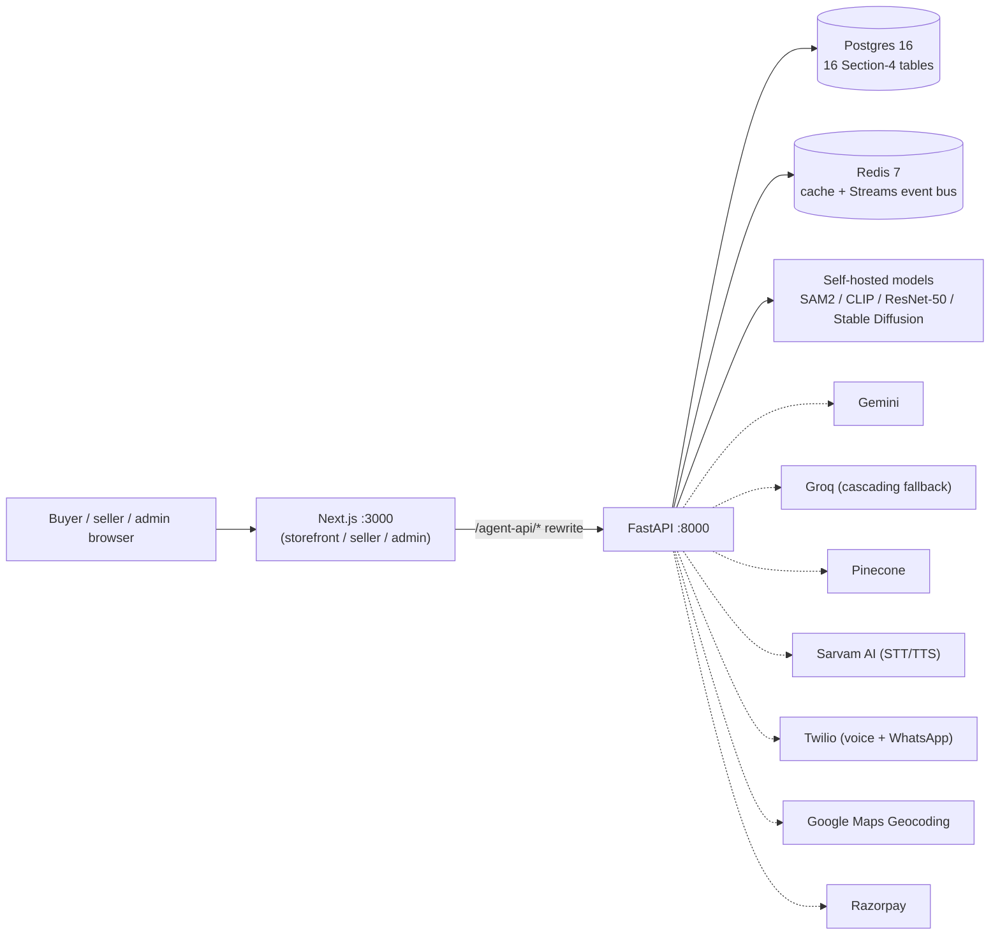

# Architecture

This document describes the system as it actually runs today. It replaces an earlier
version of this file that described a pre-rewrite design (Step Functions, DynamoDB,
S3, a single Secrets Manager JSON secret) — that design was never the deployed path;
`APP_MODE=live`/AWS Lambda code still exists in the repository (`Dockerfile`,
`template.yaml`) but is not the way this project runs or is judged. The real,
exercised path is Docker Compose + Postgres + Redis, described below.

## Runtime topology

`docker-compose.yml` runs four services: `postgres`, `redis`, `backend` (FastAPI),
`frontend` (Next.js). This is the single supported way to run the project —
`docker compose up -d`. The dotted integrations are real HTTP calls gated on the
matching API key in `.env`; when a key is absent, the provider raises a typed
`*Unavailable` exception and the calling agent degrades honestly (documented per-agent
in [AGENTS.md](AGENTS.md)) instead of returning a fabricated result.

## Data layer

Every business record lives in one Postgres database (`src/kavach_saathi/db/models.py`,
26 tables: `users`, `refresh_tokens`, `seller_profiles`, `addresses`, `products`,
`product_images`, `product_specifications`, `product_variants`, `cart_items`,
`wishlist_items`, `orders`, `order_items`, `order_status_history`, `payments`,
`razorpay_webhook_events`, `reviews`, `return_records`, `support_interactions`,
`agent_logs`, `workflow_runs`, `buyer_trust_signals`, `seller_trust_score`,
`otp_sessions`, `chat_conversations`, `chat_messages`, plus `eval_fixtures` for
offline evaluation only). `CommerceRepository` (`repository.py`) is the single repository
implementation — there is no separate demo/live storage split. `scripts/generate_seed_data.py`
seeds deterministic demo data (500 products, buyers, sellers, one `ADMIN-001` account,
orders, reviews, returns) directly into Postgres.

Redis serves two roles: a cache, and a Streams-based event bus (`events.py`).
`order.placed` and `review.submitted` are published via `XADD` when the corresponding
commerce endpoint (`POST /v1/orders`, `POST /v1/reviews`) commits, and two dedicated
consumer-group threads (started at FastAPI startup) automatically trigger Agent 7
(delivery confirmation call) and Agent 4 (review relevance check) respectively — real
`XREADGROUP`/`XACK` semantics with pending-entry redelivery, not a polling shortcut.
This is the event-bus pattern the plan's own stack table describes as "AWS SQS/SNS, or
Kafka if self-hosting."

## Request lifecycle

FastAPI serves synchronous routes directly (auth, storefront, cart, admin) and runs
agent workflows through `OrchestrationService` + a `LangGraph`-compiled graph per
workflow type (`orchestration/graph.py`, `orchestration/service.py`). Agents 1, 2, 4,
and 8 call real, multi-second-to-multi-minute self-hosted CPU model inference or real
external APIs, so their endpoints (`/v1/listings/analyze`, `/v1/reviews/analyze`,
`/v1/returns/analyze`) return `status: "queued"` immediately and execute on a dedicated
background thread with its own event loop (`app.py`'s `_run_workflow_in_background`);
the frontend polls `GET /v1/runs/{run_id}` (or consumes the SSE
`GET /v1/runs/{run_id}/events` stream) until the run reaches a terminal status. A plain
`asyncio.create_task()` was deliberately not used here — ASGI test/dev transports can
tear down a request's event loop once the request coroutine returns, which would
silently kill an in-flight model call.

Every agent call writes a row to `agent_logs` (`agent_logging.py`) with a genuine
`confidence`, `latency_ms`, `input_ref`, and `provider` string — this is the
audit trail a reviewer can query directly to confirm a given run was not fixture-driven.

## Auth and roles

JWT access (short-lived) + refresh (rotating, hashed at rest) tokens issued from
`auth.py`, bcrypt password hashing, three roles (`buyer`, `seller`, `admin`) sharing
one `users` table. `require_role(...)` guards seller (`seller_api.py`) and admin
(`admin_api.py`) routes. There is no public admin signup endpoint — the only admin
account is the seeded `ADMIN-001`; this is intentional, not an
oversight, since a self-service admin signup would be a real privilege-escalation hole.

## Provider selection

`container.py`'s `_select_reasoner()` builds a `CascadingReasoningProvider` from
whichever of `GEMINI_API_KEY`/`GROQ_API_KEY` are configured; Gemini is tried first,
Groq second (real infrastructure-level fallback, not a second attempt at the same
failure — built after live testing repeatedly hit Gemini's shared-capacity 503s).
Image-bearing calls (Agent 2/8 OCR) route Groq to a vision-capable model
(`meta-llama/llama-4-scout-17b-16e-instruct`) since Groq's default text model can't
read images at all. With neither key configured, agents fall back to `DemoReasoningProvider`,
which raises `ReasoningUnavailable` rather than fabricate a structured answer.

Agents 1, 3, 5, 6, 7, and 8 each instantiate their own config-gated provider directly
in `__init__` (e.g. `GoogleMapsGeocoder`, `SarvamClient`, `TwilioVoiceClient`,
`GoogleVisionReverseImageSearch`) rather than going through the generic
`context.media`/`context.external` split inherited from an earlier design where a
`DemoMediaProvider`/`LiveExternalProvider` split was chosen by `APP_MODE`. Since this
deployment never sets `APP_MODE=live`, that split would otherwise never activate the
real providers at all — the per-agent direct-instantiation pattern is what makes every
rewritten agent's real path reachable in the one supported deployment mode.

## Trust rules (unchanged from the original design)

- Agent confidence represents evidence strength, not a probability of buyer dishonesty.
- Fabric composition claims require label/document evidence, not seller text alone.
- Every externally visible action is a typed `AgentAction`, never inferred from summary text.
- Low-confidence returns route to manual inspection, never an automatic denial.
- A missing API key produces an honest "not configured"/`*Unavailable` response with a
  documented fallback — never a silently fabricated success.
